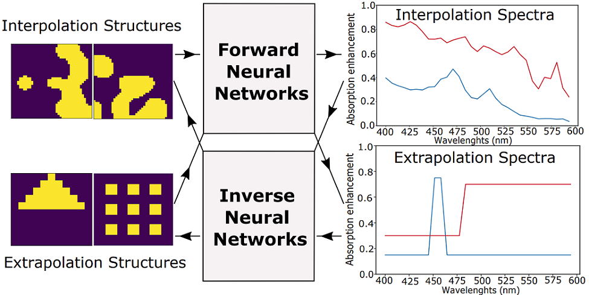

# Machine Learning in Interpolation and Extrapolation for Nanophotonic Inverse Design

This repository contains the conceptual framework, methodology, and reference implementation details for the research paper:

***Machine Learning in Interpolation and Extrapolation for Nanophotonic Inverse Design***, published in **ACS Omega**.

The project investigates how different machine learning (ML) architectures perform when used as fast surrogate models for forward and inverse nanophotonic design, with a particular focus on the fundamental distinction between **interpolation** and **extrapolation**.

---

## Overview

Inverse design in nanophotonics traditionally relies on computationally intensive iterative solvers such as adjoint-based optimization. While highly accurate, these methods are often slow and difficult to scale.

This work explores **Artificial Neural Networks (ANNs)** as high-speed surrogate models capable of mapping between nanophotonic structures and their optical responses. A central contribution of this study is a **systematic and rigorous evaluation of model generalization**, explicitly distinguishing between:

* **Interpolation**: predictions within the training data distribution
* **Extrapolation**: predictions for geometries or spectral responses not seen during training

Understanding this distinction is critical for deploying ML models in real-world nanophotonic design workflows.

---

## Project Objectives

* **Benchmark ML Architectures**
  Compare Deep Neural Networks (DNNs), Convolutional Neural Networks (CNNs), hybrid PCA–DNN models, and transfer-learning-based approaches for forward and inverse nanophotonic design.

* **Interpolation vs. Extrapolation Analysis**
  Quantify the generalization gap when ML models are tasked with predicting or designing structures outside their training regime.

* **Transfer Learning Evaluation**
  Assess the effectiveness of pre-trained models (e.g., ResNet50) for predicting electromagnetic spectra from nanophotonic geometries.

---

## Methodology

### 1. Data Generation

* **Physics Engine**: Open-source Finite-Difference Time-Domain (FDTD) simulations using **Meep**
* **Dataset Size**: 10,000 unique 2D absorbing silicon nanostructures
* **Representation**:

  * Structures encoded as (40 \times 40) binary matrices indicating the presence or absence of silicon
  * Spatial smoothing applied to approximate realistic fabrication constraints

### 2. Machine Learning Architectures Evaluated

* **ResNet50**
  Pre-trained on ImageNet and fine-tuned for optical spectral prediction

* **Standard DNN**
  Fully connected neural networks used for both forward (structure → spectrum) and inverse (spectrum → structure) mappings

* **CNN**
  Designed to exploit spatial correlations in the (40 \times 40) geometry grid

* **Hybrid PCA + DNN**
  Principal Component Analysis (PCA) for dimensionality reduction followed by a DNN

* **Tandem Networks**
  Forward–inverse coupled architectures designed to address the one-to-many mapping problem inherent in inverse design

---

## Key Results

* **DNN Superiority in Extrapolation**
  While CNNs and ResNet50 models perform strongly under interpolation, standard DNNs exhibit superior stability and lower prediction error when extrapolating to unseen geometric regimes.

* **Hybrid Model Trade-offs**
  PCA–DNN hybrids improve training efficiency and interpolation accuracy but often limit extrapolative capability.

* **Generative Inverse Design**
  Inverse models successfully generated nanostructures with target spectral responses well outside the training data bounds.

* **Computational Efficiency**
  ML-based predictions are obtained orders of magnitude faster than full-wave electromagnetic simulations.

---

## Figures and Visualizations

Representative figures from the study are included in the **`figures/`** , **` diagrams/`** and **` results/`** directory of this repository.

### Example Visuals

* Interpolation and Extrapolation structures
* Schematic representation of forward networks
* Schematic representation of inverse networks
* Forward network predictions
* Generated structures from inverse networks
* MSE between the spectra
* MSE for the validation set of interpolative structures
* Training time and training loss comparison
* Validation loss variation


```markdown

```

---

## Tech Stack

* **Programming Language**: Python
* **ML Frameworks**: TensorFlow / Keras, Scikit-learn
* **Electromagnetic Simulation**: Meep (FDTD)
* **Data Handling & Visualization**: NumPy, Pandas, Matplotlib

---

## Citation

If you find this work useful in your research, please cite:

```bibtex
@article{Acharige2022,
  author    = {Acharige, Didulani and Johlin, Eric},
  title     = {Machine Learning in Interpolation and Extrapolation for Nanophotonic Inverse Design},
  journal   = {ACS Omega},
  volume    = {7},
  number    = {37},
  pages     = {33537--33547},
  year      = {2022},
  doi       = {10.1021/acsomega.2c04526},
  publisher = {American Chemical Society}
}
```

---

## Code & Data Access

* **Code**: This repository provides the core logic for model architectures, training workflows, and evaluation metrics.
* **Dataset**: The full FDTD simulation dataset is available upon reasonable request.
* **Usage**: Please contact the author for inquiries regarding commercial use or collaborative research.

---

## Contact

**Didulani Acharige**
Department of Mechanical and Materials Engineering
Western University
Email: [dsalwath@uwo.ca](mailto:dsalwath@uwo.ca)
